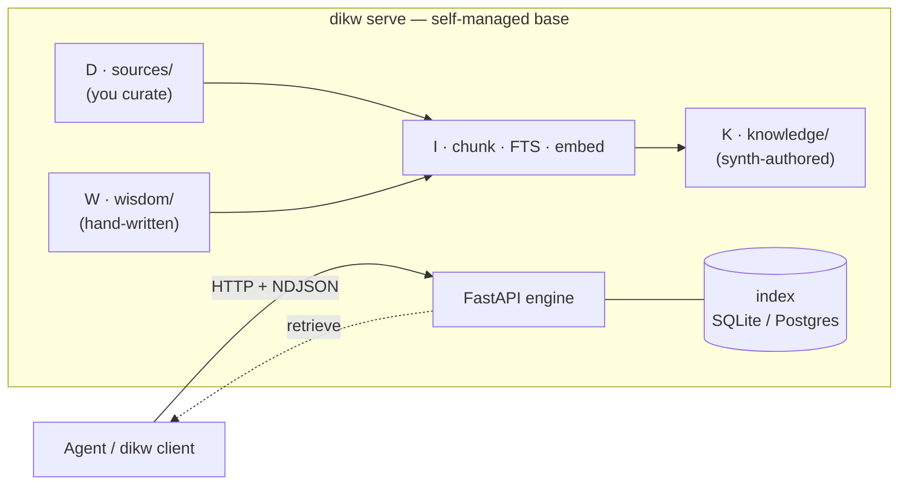

<div align="center">


# dikw-core

<p align="center">
  <a href="https://github.com/OpenDIKW/dikw-core/actions/workflows/ci.yml"></a>
  <a href="https://github.com/OpenDIKW/dikw-core/actions/workflows/codeql.yml"></a>
  <a href="https://codecov.io/gh/OpenDIKW/dikw-core"></a>
  <a href="https://pypi.org/project/dikw-core/"></a>
  <a href="https://pypi.org/project/dikw-core/"></a>
  <a href="https://github.com/OpenDIKW/dikw-core/pkgs/container/dikw-core"></a>
  <a href="https://github.com/astral-sh/ruff"></a>
  <a href="https://github.com/OpenDIKW/dikw-core/blob/main/LICENSE"></a>
  
</p>

</div>

**An AI-native knowledge base engine that turns your documents into Data → Information → Knowledge → Wisdom.**

`dikw-core` is a **client/server knowledge base engine**. A long-lived `dikw serve` process owns the base — its directory tree, its index, and its database are **self-managed by the server**: it ingests sources, synthesizes a knowledge layer, indexes everything for hybrid search, and reconciles the on-disk files with the index. Clients (`dikw client …`, or any agent over HTTP) talk to it; they never reach into its storage directly. Knowledge is persisted as an **open, portable Markdown tree** you can move, diff, and version anywhere.

This is **different from Obsidian**: Obsidian is a local editor for a vault you maintain by hand, with no engine behind it. `dikw-core` is the engine — it authors, indexes, retrieves, and keeps the base consistent — and the Markdown it manages happens to open in any editor.

Inspired by [Karpathy's LLM Wiki pattern](https://gist.github.com/karpathy/442a6bf555914893e9891c11519de94f) and extended end-to-end across the full DIKW pyramid: where Karpathy's pattern stops at a compounding markdown knowledge base (the K layer), `dikw-core` adds a first-class **Wisdom layer** for human-authored principles, lessons, and patterns that apply beyond any single source. Its on-disk format shares that lineage with Google's [Open Knowledge Format](https://cloud.google.com/blog/products/data-analytics/how-the-open-knowledge-format-can-improve-data-sharing) and aims to interoperate with it.

> **Status: alpha.** Under active construction — APIs, on-disk formats, database schema, and CLI will change. See [CHANGELOG.md](./CHANGELOG.md).

## How it fits together



The server owns the base on disk and the index/DB behind it; agents drive it over HTTP and get back ranked chunks + page refs. **`dikw-core` does not synthesize the final answer** — `retrieve` returns evidence and the agent (Claude Code, ChatGPT, your own script) runs its own LLM over it. See [`GUIDE_FOR_AGENTS.md`](./GUIDE_FOR_AGENTS.md).

## What you get

- A **server-managed knowledge base** — the **dikw base** — whose on-disk layout is a **plain, portable Markdown tree**. The server is the authority for what gets written, indexed, and reconciled; the files stay open and any Markdown editor can read them.
- Four explicit DIKW layers, each with its own operations:
  - **D**ata — raw sources you curate under `sources/`.
  - **I**nformation — parsed, chunked, embedded, indexed (FTS5 + vectors).
  - **K**nowledge — LLM-authored knowledge pages with `[[wikilinks]]`, filed under a configurable `category` tree (`knowledge/<category>/<slug>.md`). Engine-written, and your hand-edits are reconciled rather than clobbered.
  - **W**isdom — hand-written principles / lessons / patterns under `wisdom/<author>/`, indexed (chunked + embedded) so they surface in `retrieve` alongside K-layer pages.
- **Client / server architecture.** A long-lived `dikw serve` (FastAPI + NDJSON) hosts the engine; the `dikw client …` Typer CLI talks to it over HTTP, streams progress events for long ops, and supports cancel / resume.
- Pluggable LLM providers (API-first): Anthropic + OpenAI-compatible (covers OpenAI, Azure, Ollama, DeepSeek, Gemini-compat).
- Pluggable storage: SQLite + sqlite-vec (default), Postgres + pgvector (enterprise) — swap by config.

## Quick start

Requires Python 3.12+ and [`uv`](https://docs.astral.sh/uv/).

```bash
git clone https://github.com/OpenDIKW/dikw-core
cd dikw-core
uv sync

uv run dikw init my-base --description "my research base"
cd my-base
# Drop some markdown into sources/, then run any single command via
# `dikw client serve-and-run` — it spawns a local server, runs the
# inner command, and tears it down.
uv run dikw client serve-and-run -- ingest --no-embed
uv run dikw client serve-and-run -- retrieve "What does Karpathy mean by deterministic scoping?"
```

For interactive sessions or long iterations, run `dikw serve` once and
keep using `dikw client *` against it:

```bash
uv run dikw serve --base .   # in one terminal
# in another:
uv run dikw client status
uv run dikw client synth               # K layer (needs ANTHROPIC_API_KEY or OpenAI-compat)
uv run dikw client retrieve "What does Karpathy mean by deterministic scoping?"
```

Every HTTP-bound command is spelled out as `dikw client <verb>` — there are no
top-level short aliases, which keeps the local-vs-HTTP boundary unambiguous.

### Install from PyPI (downstream consumers)

The block above is the from-source flow. To **use** dikw-core without a
checkout, install the published wheel — the `dikw` command lands on your PATH:

```bash
uv pip install 'dikw-core[postgres]'   # or plain pip; drop [postgres] for SQLite-only
dikw init my-base && cd my-base
dikw serve --base .
```

Optional extras: **`postgres`** (pgvector backend), **`cjk`** (`jieba` — the
default config selects it, so ingesting Chinese/CJK text errors without it),
**`otel`** ([OpenTelemetry](./docs/observability.md)). Pin a version to match
your server — `dikw client` hard-fails on a [version skew](./docs/server.md).
Full extras matrix in
[`docs/getting-started.md`](./docs/getting-started.md#optional-extras).

For container deployment, see [`examples/docker/`](./examples/docker/)
(Dockerfile + compose stack with `pgvector/pgvector:0.8.2-pg18`) and the
long-form [`docs/deployment-docker.md`](./docs/deployment-docker.md).

## Commands

Local-only commands run in this process:

| command                     | does                                                                          |
| --------------------------- | ----------------------------------------------------------------------------- |
| `dikw version`              | print the package version                                                     |
| `dikw init <path>`          | scaffold a dikw base (sources / knowledge / wisdom / `.dikw/` + `dikw.yml`)        |
| `dikw serve --base <path>`  | start the FastAPI + NDJSON server bound to one base                           |

Everything else lives under `dikw client *` and talks to a running server.
There are **no** top-level short aliases — spelling out the `client` prefix
keeps the local-vs-HTTP boundary unambiguous for both agents and humans:

| command                     | does                                                                          |
| --------------------------- | ----------------------------------------------------------------------------- |
| `dikw client status`        | counts across DIKW layers                                                     |
| `dikw client info`          | raw `GET /v1/info` passthrough — version, storage backend, auth posture       |
| `dikw client health`        | server self-description (base, version, storage, providers) — the first call an agent makes |
| `dikw client check`         | ping the configured LLM + embedding endpoints to verify `dikw.yml` + keys     |
| `dikw client import <path>` | pre-flight + import local md packages (md + referenced assets) into the server's `sources/` |
| `dikw client ingest [--no-embed]` | parse + chunk + FTS-index + embed the server's `sources/` tree           |
| `dikw client retrieve "<q>"` | hybrid search returning ranked chunks + page refs (no LLM call); agent supplies its own synthesis |
| `dikw client synth [--all]` | LLM turns source docs into K-layer knowledge pages, filed under the configured `category` tree |
| `dikw client wisdom write`  | write a W-layer page (slug + title + body + metadata) and index it            |
| `dikw client delete <path>` | soft-delete a D/K/W document to `<base>/trash/` and purge its rows            |
| `dikw client lint [propose\|proposals\|apply]` | report broken wikilinks / orphan pages / duplicate titles / disk-index drift; propose + apply structured fixes |
| `dikw client pages {list,get,links,provenance}` | enumerate pages / read a page body + chunk anchors / walk the K-layer link graph / walk the K↔D provenance edge |
| `dikw client graph get`     | fetch the whole base graph (nodes + edges + unresolved wikilinks) in one read |
| `dikw client assets get <id> --output <file>` | download a content-addressed asset by sha256 id              |
| `dikw client eval [--dataset]` | run retrieval-quality evaluation against packaged or custom datasets       |
| `dikw client tasks {list,status,events,wait,cancel}` | inspect running / past async tasks on the server         |
| `dikw client serve-and-run -- <cmd>` | one-shot server + inner command + teardown (no long-lived `dikw serve` needed) |

The `dikw auth {login,import,status,list,logout}` subgroup is **local** —
it manages OAuth tokens in `<base>/.dikw/auth.json` without talking to a
server (used by the `openai_codex` provider; see [`docs/providers.md`](./docs/providers.md)).

## Providers

Configured via `dikw.yml`. `llm` names a wire **protocol** (which SDK to speak),
not a vendor — the actual vendor is whatever `llm_base_url` points at:

```yaml
provider:
  llm: anthropic_compat         # or: openai_compat
  llm_model: claude-sonnet-4-6
  llm_base_url: null            # set for any Anthropic-protocol-compatible endpoint
  llm_api_key_env: ANTHROPIC_API_KEY      # required: names the env var holding the LLM key
  embedding: openai_compat      # protocol; any OpenAI-compatible endpoint
  embedding_model: bge-m3       # dikw init default: Gitee AI bge-m3
  embedding_base_url: https://ai.gitee.com/v1
  embedding_api_key_env: GITEE_API_KEY    # required: names the env var holding the embedding key
  embedding_dim: 1024           # required: must match what the endpoint returns
  embedding_batch_size: 16      # Gitee caps the input array at 25
  embedding_normalize: true
  embedding_distance: cosine
```

- `anthropic_compat` → uses the `anthropic` async SDK with `cache_control`
  on the system prompt, so repeated synth calls hit the prompt cache. Set
  `llm_base_url` to retarget the SDK at any Anthropic-protocol-compatible
  endpoint (e.g., MiniMax's `https://api.minimaxi.com/anthropic`).
- `openai_compat` → uses the `openai` async SDK against any base URL that
  speaks the OpenAI HTTP surface (Azure, Ollama, vLLM, DeepSeek, MiniMax, …).

Each leg names its own env var via `llm_api_key_env` / `embedding_api_key_env`,
so keys are vendor-canonical (`ANTHROPIC_API_KEY`, `OPENAI_API_KEY`,
`DEEPSEEK_API_KEY`, `MINIMAX_API_KEY`, `GITEE_API_KEY`, …) and multiple
same-protocol vendors coexist in one `.env` — each base picks which var it reads.

Verify connectivity before a real run — `dikw client check` pings each provider
with one tiny request and prints endpoint / latency / dim, exiting non-zero on
failure (scriptable in CI):

```bash
uv run dikw client check --llm-only     # just LLM
uv run dikw client check --embed-only   # just embedding
uv run dikw client check                # both
```

The full vendor cookbook (MiniMax, GLM, Gemini, DeepSeek, Gitee AI, Ollama, …),
a worked **MiniMax LLM + Gitee AI embeddings** config, and the production
gotchas around batch size, embedding dimensions, retry, and prompt caching live
in [`docs/providers.md`](./docs/providers.md).

## Storage

Two backends ship, selected in `dikw.yml`:

```yaml
storage:
  backend: sqlite          # sqlite | postgres

  # --- sqlite (default): single-user local ---
  path: .dikw/index.sqlite

  # --- postgres (enterprise): multi-user, pgvector + tsvector ---
  # backend: postgres
  # dsn: postgresql://user:pw@host:5432/dikw
  # schema: dikw
  # pool_size: 10
```

- **SQLite + `sqlite-vec` + FTS5** — the default. No extras required.
- **Postgres + `pgvector`** — install via `uv pip install dikw-core[postgres]`.
  Requires the `pg_trgm` and `vector` extensions (standard on the
  `pgvector/pgvector:0.8.2-pg18` Docker image). The adapter uses `tsvector` + GIN
  for FTS and `vector(N)` for embeddings; the vector dimension is set at
  first insert.

Engine code talks only to the `Storage` Protocol
([`storage/base.py`](./src/dikw_core/storage/base.py)); each adapter
implements the same contract and is swappable by changing `dikw.yml`.

## Source formats

Markdown ships out of the box. A new format is one `SourceBackend`
subclass + a `register()` call away — see
[`domains/data/backends/markdown.py`](./src/dikw_core/domains/data/backends/markdown.py)
for the reference impl.

## Documentation

| doc | what it covers |
| --- | --- |
| [`docs/getting-started.md`](./docs/getting-started.md) | end-to-end walkthrough from a blank directory to a queryable base |
| [`docs/architecture.md`](./docs/architecture.md) | module map, layer contracts, the seams to extend |
| [`docs/design.md`](./docs/design.md) | approved design doc — the source of truth for intent |
| [`docs/server.md`](./docs/server.md) | server deployment, security posture, the wire contract |
| [`docs/providers.md`](./docs/providers.md) | per-vendor config cookbook + production gotchas |
| [`docs/deployment-docker.md`](./docs/deployment-docker.md) | container deployment (Dockerfile + compose) |
| [`docs/observability.md`](./docs/observability.md) | OpenTelemetry traces / metrics / logs |
| [`docs/releasing.md`](./docs/releasing.md) | maintainer release flow (PyPI + GHCR + GitHub Release) |
| [`docs/adr/`](./docs/adr/) | architecture decision records |

## Contributing

Issues and pull requests are welcome. Start with
[`CONTRIBUTING.md`](./CONTRIBUTING.md) for the dev setup (`uv sync --all-extras`),
the local CI gate (`uv run python tools/check.py`), and the delivery workflow.
Please also read the [Code of Conduct](./CODE_OF_CONDUCT.md). To report a
security issue, see [`SECURITY.md`](./SECURITY.md).

## License

MIT — see [LICENSE](./LICENSE).
